# 🕵️ Analysis of Competing Hypotheses (ACH)

  

> **"The hypothesis with the most evidence is not necessarily correct. The hypothesis with the least contradictions often is."**
> — *Richards Heuer, CIA Analyst*

**Analysis of Competing Hypotheses** is a rigorous analytic technique developed by the U.S. Intelligence Community to overcome cognitive biases that plague human decision-making. ArkhamMirror brings this powerful methodology to investigative journalists, researchers, and analysts with a modern, interactive implementation.

---

## 📑 Table of Contents

1. [Why ACH?](#-why-ach)
2. [Feature Highlights](#-feature-highlights)
3. [Keyboard Shortcuts](#-keyboard-shortcuts)
4. [The 8-Step Process](#-the-8-step-process)
   - [Step 1: Brainstorm Hypotheses](#step-1-brainstorm-hypotheses)
   - [Step 2: Gather Evidence](#step-2-gather-evidence)
   - [Step 3: Create the Matrix](#step-3-create-the-matrix)
   - [Step 4: Refine the Matrix](#step-4-refine-the-matrix-diagnosticity)
   - [Step 5: Draw Conclusions](#step-5-draw-conclusions)
   - [Step 6: Sensitivity Analysis](#step-6-sensitivity-analysis)
   - [Step 7: Report Conclusions](#step-7-report-conclusions)
   - [Step 8: Export](#step-8-export)
5. [Methodology Deep Dive](#-methodology-deep-dive)
6. [Tips for Best Results](#-tips-for-best-results)

---

## 🧠 Why ACH?

Traditional analysis is vulnerable to **confirmation bias** — the tendency to seek out and remember information that supports what we already believe. We build narratives around the first plausible explanation and unconsciously filter out contradictory evidence.

ACH flips the script:

| Traditional Analysis | ACH Approach |
|:---|:---|
| ❌ "What evidence supports my theory?" | ✅ "What evidence **contradicts** each theory?" |
| ❌ Stops at the first plausible explanation | ✅ Systematically tests **all** explanations |
| ❌ Confirmation bias goes unnoticed | ✅ Bias made **visible** in the matrix |
| ❌ Conclusions are hard to defend | ✅ Conclusions are **auditable and transparent** |

---

## ✨ Feature Highlights

  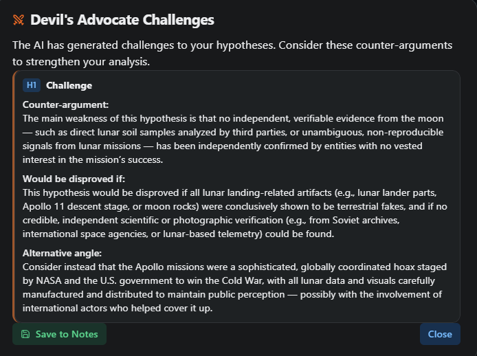

ArkhamMirror's ACH implementation goes beyond the classic paper-based method:

| Feature | Description |
|:---|:---|
| 🤖 **AI Assistance** | Generate hypotheses, find evidence, get rating suggestions, and challenge your thinking with Devil's Advocate mode |
| 📂 **Corpus Integration** | Import evidence directly from your uploaded documents with source links |
| 📊 **Auto-Scoring** | Real-time inconsistency scores and hypothesis rankings |
| 🔬 **Sensitivity Analysis** | "What if" scenarios to test how robust your conclusions are |
| 📄 **Professional Export** | PDF, Markdown, and JSON exports with AI disclosure flags |
| 📜 **Decision History** | Track how your analysis evolved over time |

---

## ⌨️ Keyboard Shortcuts

Speed through your analysis with these shortcuts (active on the Matrix step):

| Key | Action |
|:---:|:---|
| <kbd>↑</kbd> <kbd>↓</kbd> <kbd>←</kbd> <kbd>→</kbd> | Navigate between cells |
| <kbd>Tab</kbd> | Move to next cell |
| <kbd>1</kbd> | **Very Consistent** (CC) |
| <kbd>2</kbd> | **Consistent** (C) |
| <kbd>3</kbd> | **Neutral** (N) |
| <kbd>4</kbd> | **Inconsistent** (I) |
| <kbd>5</kbd> | **Very Inconsistent** (II) |
| <kbd>Ctrl</kbd>+<kbd>K</kbd> | Open Global Search |
| <kbd>Esc</kbd> | Deselect / Close dialogs |

---

## 📋 The 8-Step Process

ArkhamMirror guides you through the complete ACH methodology with an interactive step-by-step wizard.

  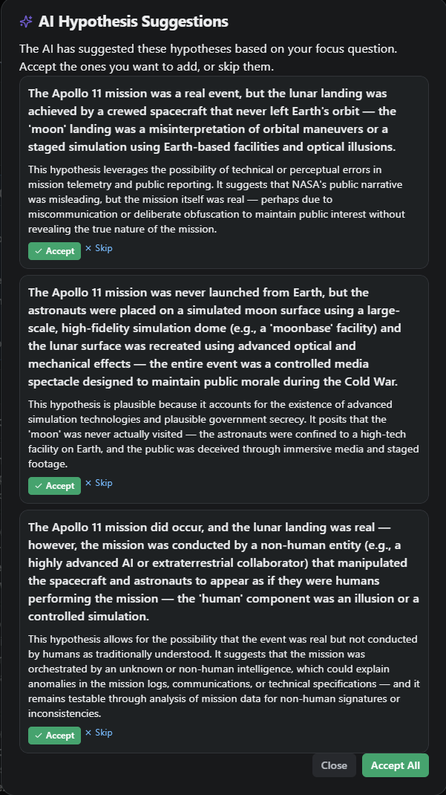

---

### Step 1: Brainstorm Hypotheses

> **Goal**: Define all possible explanations for your problem — including ones you think are unlikely.

  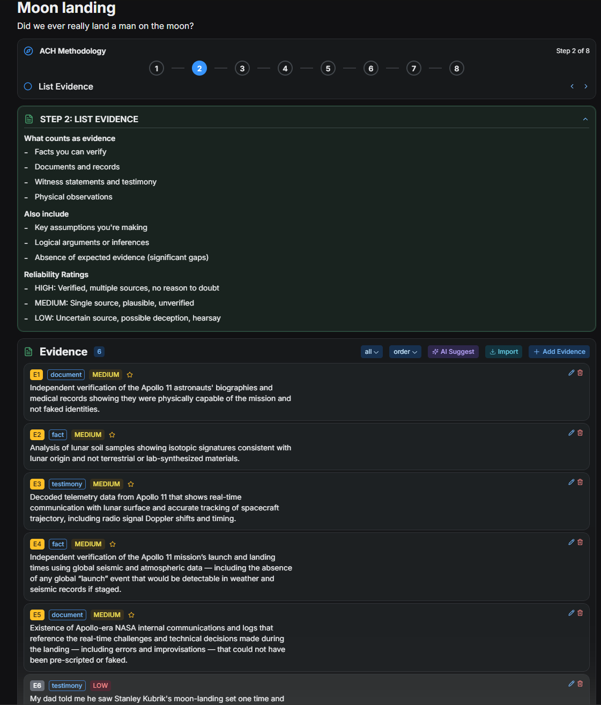

The first step is to list every hypothesis that could explain the situation. The key is to be **comprehensive**, not restrictive. Include hypotheses that seem unlikely — ACH works by elimination, so you need candidates to eliminate.

#### Adding Hypotheses

  

For each hypothesis, provide:

- **Title**: A short, descriptive name (e.g., "Inside Job by CFO")
- **Description**: A fuller explanation of what this hypothesis claims

#### AI-Assisted Hypothesis Generation

  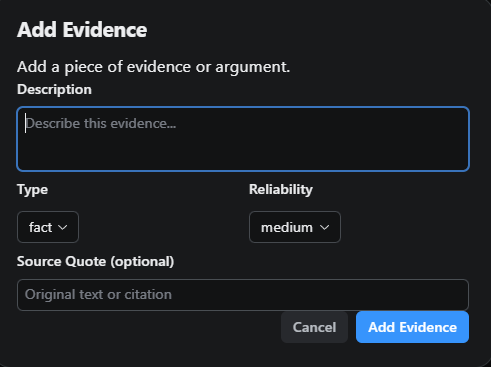

Click the **✨ AI Suggest** button to have the AI generate hypotheses based on:

- Your stated focus question
- Evidence already in your corpus
- Common patterns in similar investigations

#### Devil's Advocate Mode

  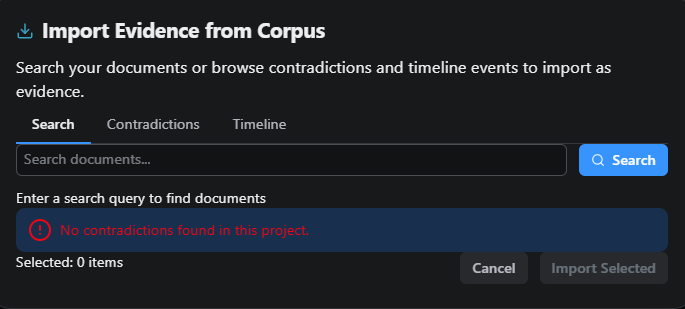

Use the **😈 Devil's Advocate** feature to challenge your thinking. The AI will:

- Point out hypotheses you may have overlooked
- Identify assumptions you're making
- Suggest alternative framings of the problem

> **💡 Pro Tip**: Force yourself to include at least one hypothesis you *don't* believe. If your analysis can't eliminate it, you may be missing something.

---

### Step 2: Gather Evidence

> **Goal**: List all significant items of evidence, arguments, and assumptions.

  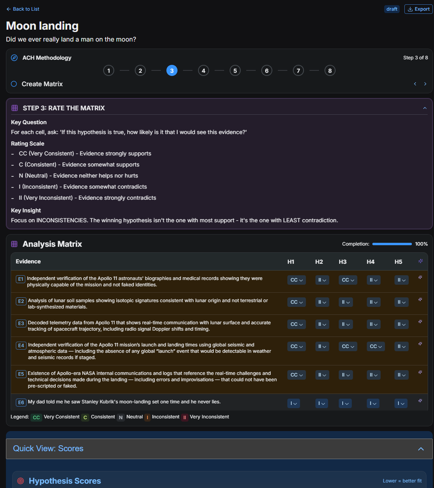

Evidence in ACH includes:

- **Facts**: Concrete, verifiable information
- **Arguments**: Logical inferences that follow from facts
- **Assumptions**: Beliefs taken for granted (mark these clearly!)

#### Adding Evidence Manually

  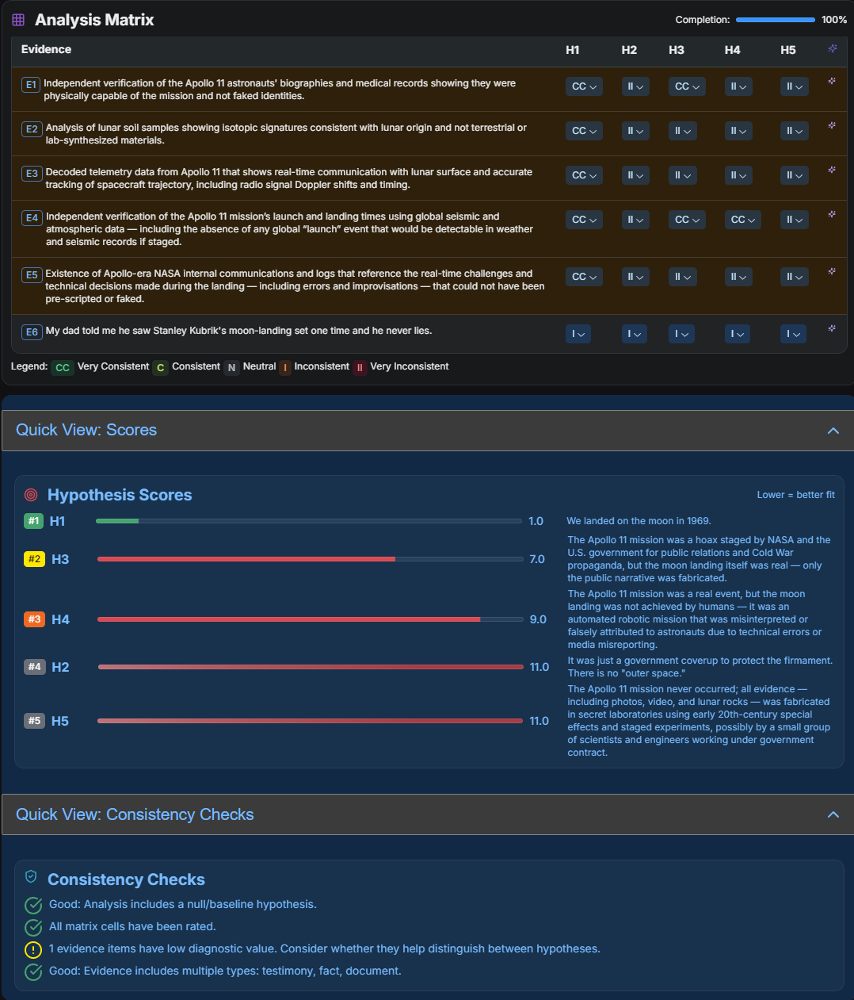

For each piece of evidence:

- **Content**: What is the evidence? Be specific.
- **Source**: Where did it come from? (Document name, page number, interview transcript, etc.)
- **Credibility**: How reliable is this source? (High / Medium / Low)

#### Importing from Your Corpus

  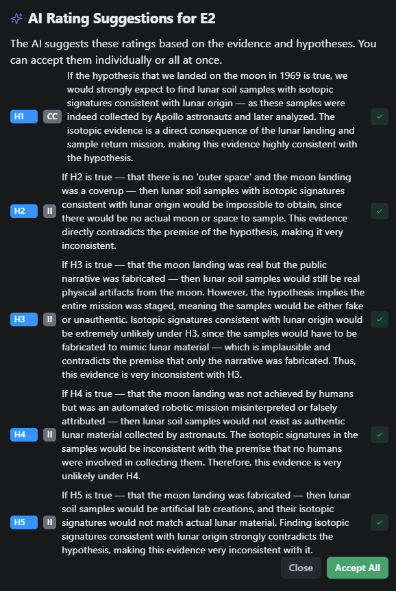

Click **📂 Import from Corpus** to search your uploaded documents:

1. Enter a search query or browse by entity
2. Select relevant excerpts
3. Evidence is imported with automatic source linking

> **💡 Pro Tip**: High-quality evidence is *specific and verifiable*. "Company was struggling" is weak. "Q3 revenue dropped 40% YoY per SEC filing" is strong.

---

### Step 3: Create the Matrix

> **Goal**: Rate every piece of evidence against every hypothesis.

  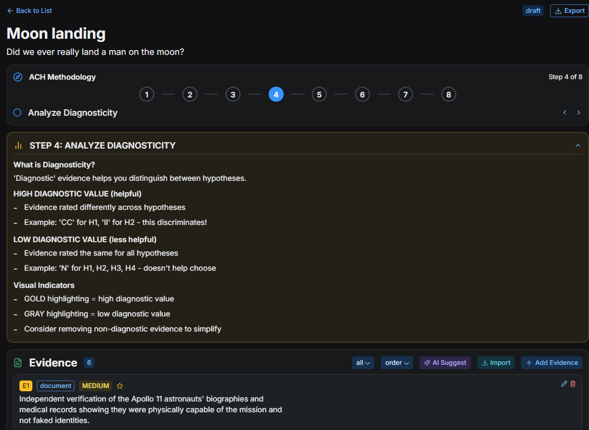

This is the heart of ACH. For each cell in the matrix, you ask: **"If this hypothesis were true, how consistent is this evidence with it?"**

#### Rating Scale

| Rating | Meaning | When to Use |
|:---:|:---|:---|
| **CC** | Very Consistent | Evidence strongly supports this hypothesis |
| **C** | Consistent | Evidence is compatible with this hypothesis |
| **N** | Neutral | Evidence is irrelevant to this hypothesis |
| **I** | Inconsistent | Evidence is hard to explain if this hypothesis is true |
| **II** | Very Inconsistent | Evidence would be nearly impossible if this hypothesis is true |

  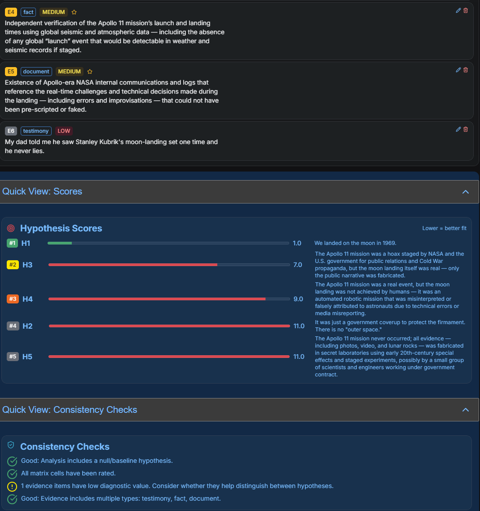

#### AI-Suggested Ratings

Click the **✨** icon on any evidence row to get AI-suggested ratings. The AI:

- Reads the evidence text and your document context
- Considers logical implications for each hypothesis
- Provides explanations for its suggested ratings

> **⚠️ Important**: AI suggestions are *starting points*. Always review and adjust based on your domain expertise.

---

### Step 4: Refine the Matrix (Diagnosticity)

> **Goal**: Focus on evidence that actually helps distinguish between hypotheses.

  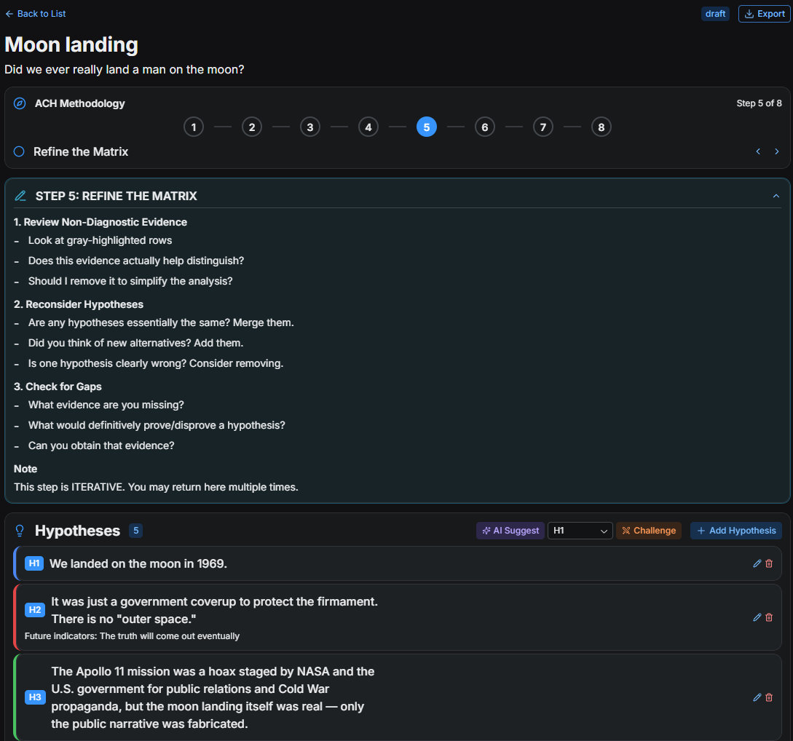

Not all evidence is equally useful. **Diagnostic evidence** is rated differently across hypotheses — it helps you distinguish between them. **Non-diagnostic evidence** is rated the same for all hypotheses — it doesn't help you decide.

#### Understanding Diagnosticity

  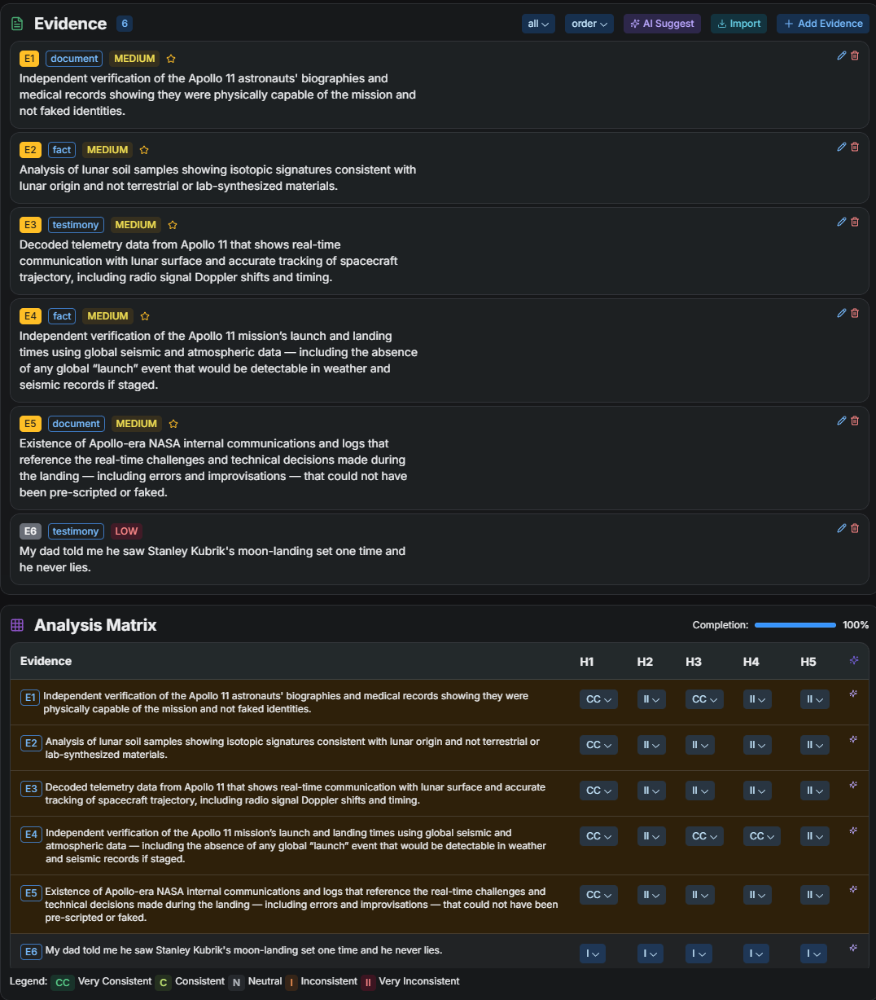

| Diagnosticity | Description | Action |
|:---|:---|:---|
| 🔴 **High** | Different ratings across hypotheses | Keep and scrutinize closely |
| 🟡 **Medium** | Some variation in ratings | May be useful |
| ⚪ **Low** | Same rating for all hypotheses | Consider removing to reduce noise |

#### Filtering by Diagnosticity

  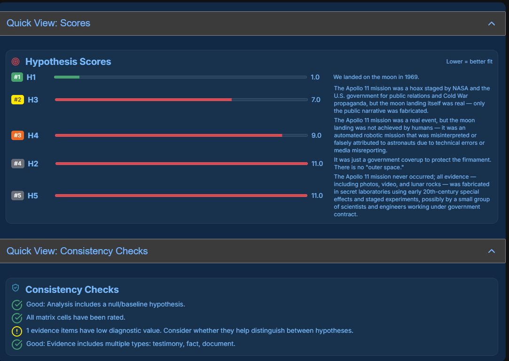

Use the filter dropdown to:

- Show only **Highly Diagnostic** evidence
- Hide completed/reviewed items
- Focus on evidence needing your attention

> **💡 Pro Tip**: If all your evidence is "Consistent" across all hypotheses, you haven't found any disconfirming evidence. Go back and look harder!

---

### Step 5: Draw Conclusions

> **Goal**: Rank hypotheses by their inconsistency scores.

  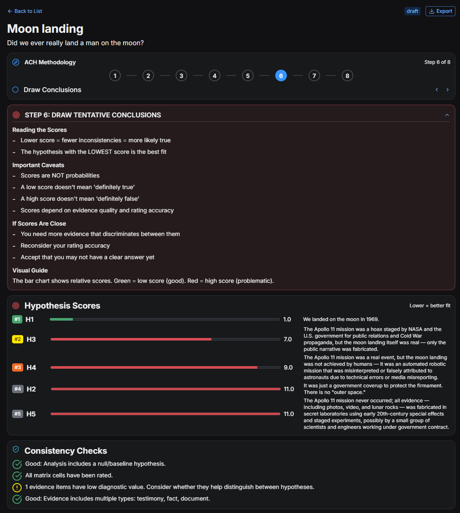

ACH conclusions are based on **disconfirmation**, not confirmation:

> 🏆 **The "winner" is the hypothesis with the LOWEST inconsistency score** — the one that is hardest to disprove.

#### Understanding the Scores

  

- **Inconsistency Score**: Weighted sum of I and II ratings
- **Lower is better**: Fewer contradictions = more likely
- The visualization shows a ranked bar chart of all hypotheses

| Inconsistency Score | Interpretation |
|:---:|:---|
| 0-2 | Very strong candidate |
| 3-5 | Plausible, minor issues |
| 6-10 | Significant problems |
| 10+ | Likely incorrect |

---

### Step 6: Sensitivity Analysis

> **Goal**: Test how robust your conclusion is. What if key evidence is wrong?

  

Even the best analysis depends on assumptions. Sensitivity analysis asks: **"What would change my conclusion?"**

#### Running the Analysis

  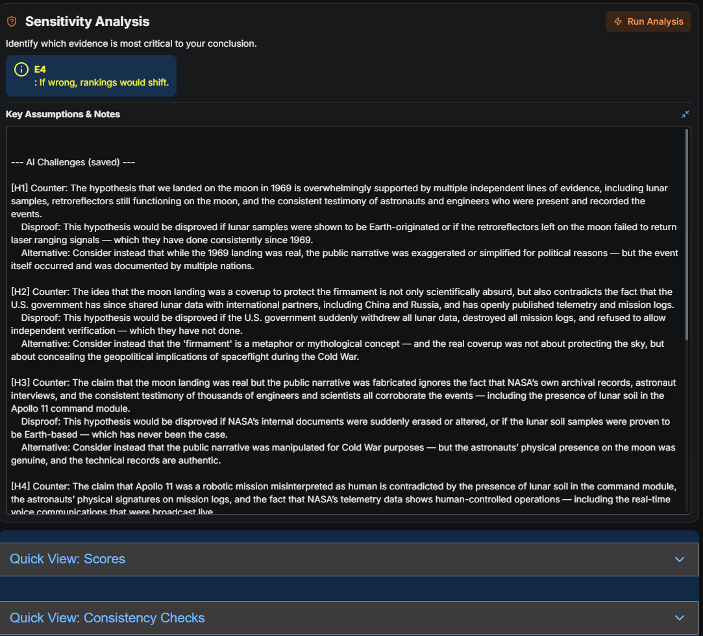

Click **🔬 Run Sensitivity Analysis** to automatically:

1. Identify which evidence items are most impactful
2. Simulate removing each piece of evidence
3. Flag items that would **change the winning hypothesis**

#### Critical Evidence Flags

  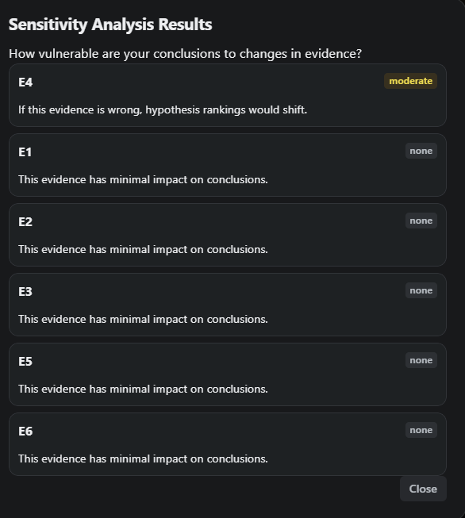

Evidence marked as **🔴 Critical** means:
> If this evidence were removed or proven false, a *different* hypothesis would win.

**Action**: Double-check the source and credibility of all critical evidence. Can you corroborate it?

---

### Step 7: Report Conclusions

> **Goal**: Document your findings, assumptions, and vulnerabilities.

  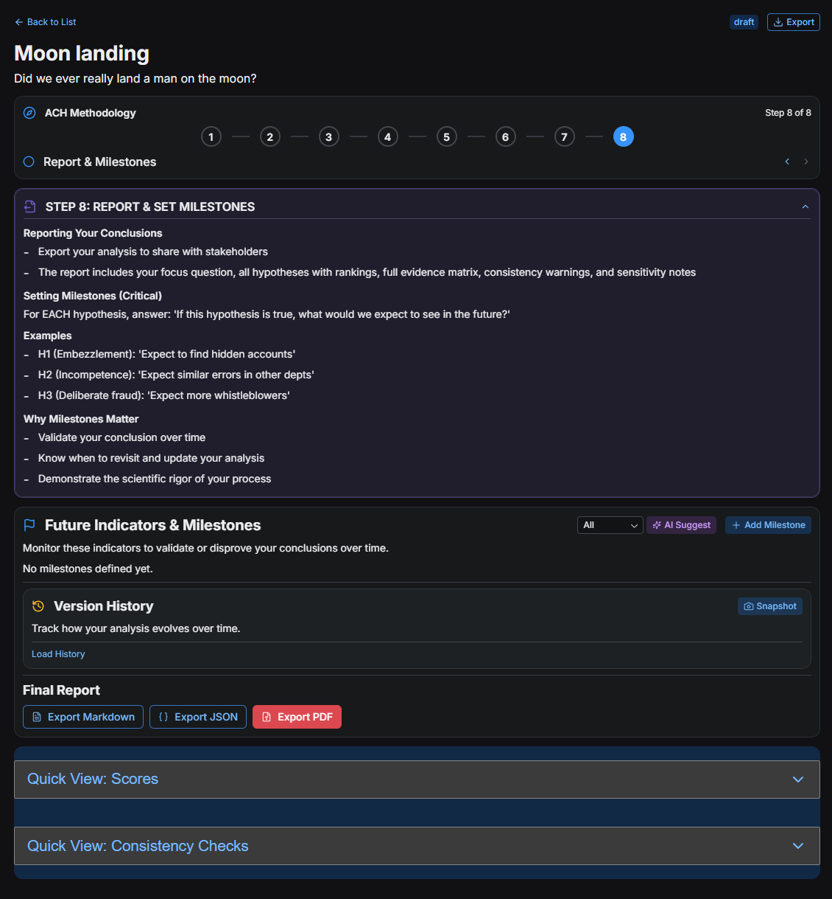

Before exporting, record:

- **Winning Hypothesis**: Your primary conclusion
- **Runner-Up**: The second most likely hypothesis
- **Key Assumptions**: What must be true for your conclusion to hold?
- **Critical Vulnerabilities**: What could overturn your conclusion?

  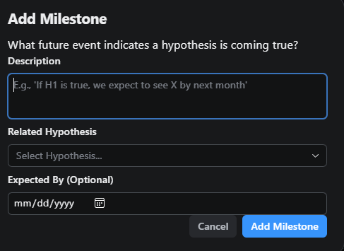

> **💡 Pro Tip**: The best analysts are transparent about uncertainty. State your confidence level honestly (High / Medium / Low).

---

### Step 8: Export

> **Goal**: Share your analysis in a professional, auditable format.

  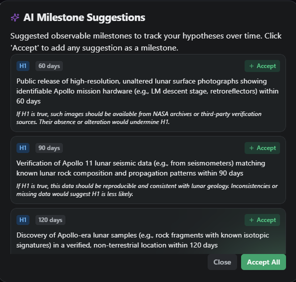

ArkhamMirror offers three export formats:

#### PDF Export

  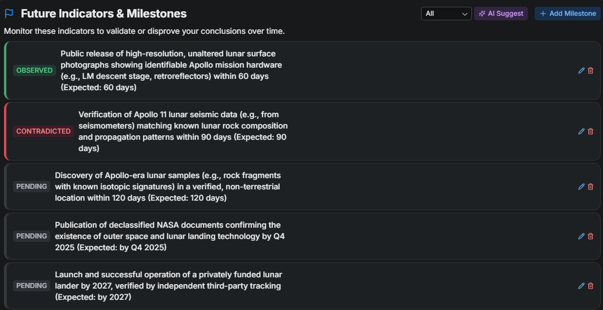

Professional PDF reports include:

- Color-coded evidence matrix
- Hypothesis rankings and scores
- Sensitivity analysis results
- Source citations

#### Markdown Export

  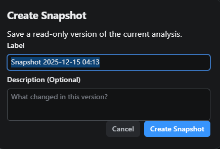

Clean, portable text format ideal for:

- Sharing on GitHub or internal wikis
- Easy editing and version control
- Including in larger reports

#### JSON Export

  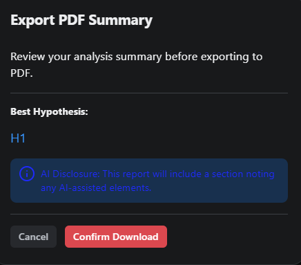

Structured data export for:

- Programmatic access
- Archival and backup
- Integration with other tools

#### AI Disclosure

All exports automatically include an **AI Disclosure** section that flags:

- Which hypotheses were AI-suggested
- Which evidence items were AI-imported
- Which ratings were AI-assisted

> **🔍 Transparency**: This ensures your analysis is auditable and honest about AI assistance.

---

### Alternate Export: Rich PDF

  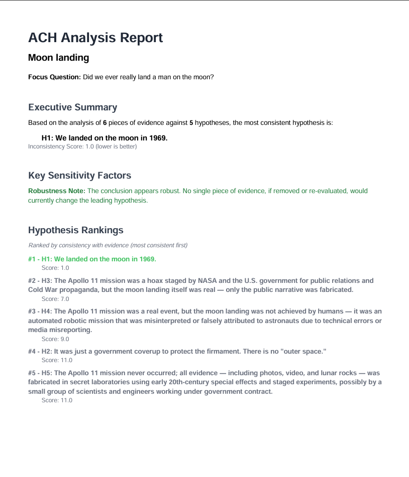

  

  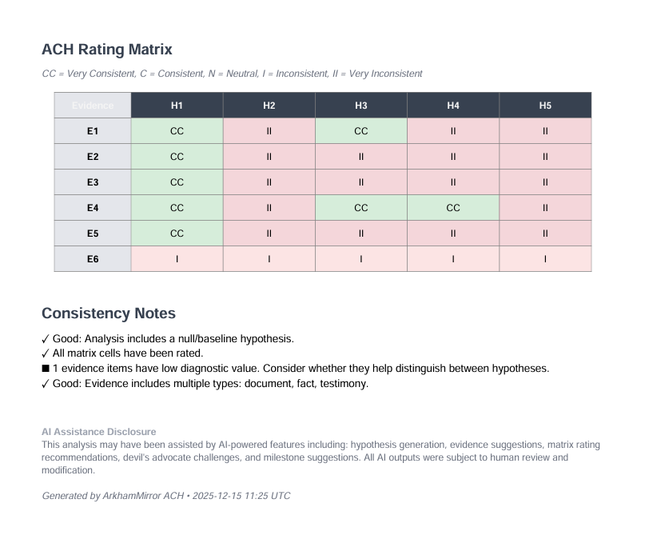

---

## 📚 Methodology Deep Dive

### Why Do We Count Inconsistencies, Not Consistencies?

The core insight of ACH is that **confirmation bias makes it easy to find supporting evidence for almost any theory**. If you look hard enough, you can find "evidence" that aliens built the pyramids.

What's much harder is explaining away a **flat contradiction**. A single piece of truly inconsistent evidence can be enough to reject a hypothesis entirely.

> 🧪 Science works the same way: theories are never "proven," only "not yet disproven."

### The Cognitive Biases ACH Addresses

| Bias | Problem | How ACH Helps |
|:---|:---|:---|
| **Confirmation Bias** | Seeking evidence that confirms beliefs | Forces you to look for *disconfirming* evidence |
| **Satisficing** | Stopping at "good enough" | Requires testing *all* hypotheses |
| **Anchoring** | First impression dominates | Matrix makes all hypotheses equal |
| **Groupthink** | Consensus overrides analysis | Explicit process invites challenge |
| **Availability Heuristic** | Recent/memorable events seem more likely | Evidence is evaluated systematically |

### Historical Context

ACH was developed by **Richards J. Heuer Jr.** at the CIA in the 1980s. His book *Psychology of Intelligence Analysis* remains a foundational text for analysts worldwide. The method was designed specifically to:

1. Make the analytic process **explicit** and transparent
2. Force analysts to consider **all** possibilities
3. Provide an **audit trail** for decisions
4. Help teams with different backgrounds reach **consensus**

---

## 💡 Tips for Best Results

### ✅ Do

- **Cast a wide net**: Include hypotheses you think are unlikely
- **Be specific**: Vague evidence is useless evidence
- **Mark assumptions**: If it's not a verifiable fact, say so
- **Use credibility ratings**: Not all sources are equal
- **Run sensitivity analysis**: Know your vulnerabilities
- **Document everything**: Future-you will thank present-you

### ❌ Don't

- **Don't stop at the first good answer**: That's what ACH is designed to prevent
- **Don't treat AI suggestions as gospel**: They're starting points, not conclusions
- **Don't ignore inconvenient evidence**: If you can't explain it, your hypothesis has a problem
- **Don't forget to update**: As new evidence arrives, re-run the analysis

---

## 🚀 Ready to Start?

Navigate to **ACH** in the sidebar to begin your first analysis. The step-by-step wizard will guide you through the entire process.

  <a href="../README.md">← Back to Main Documentation</a>

